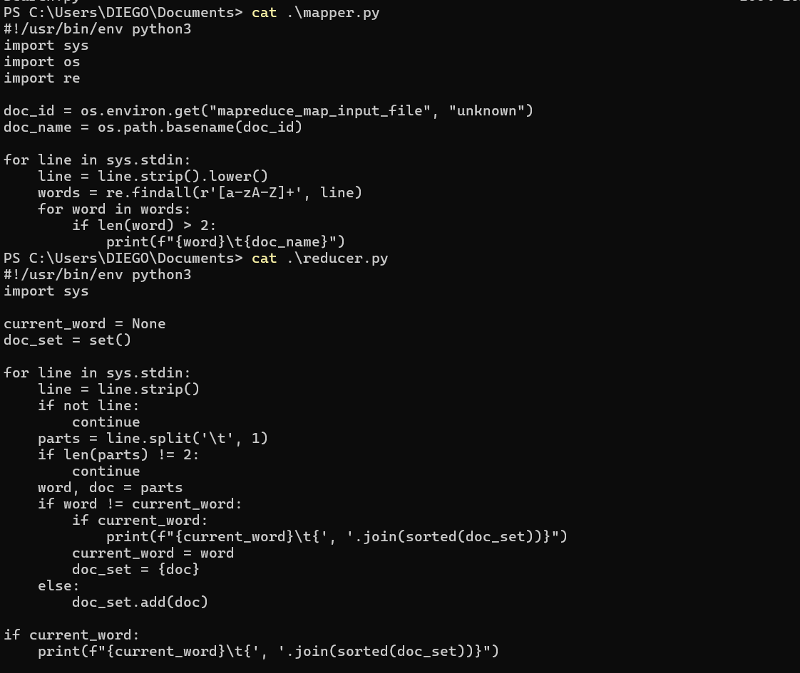
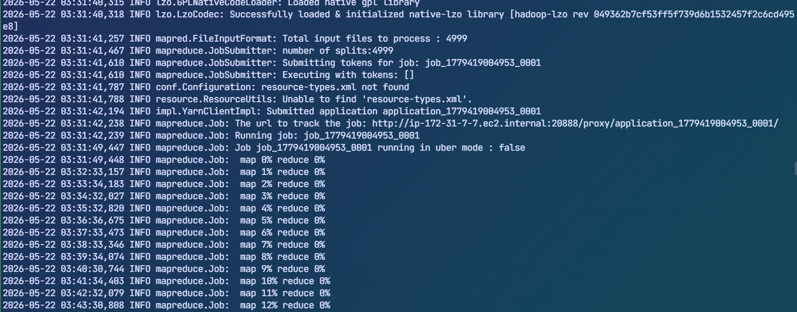
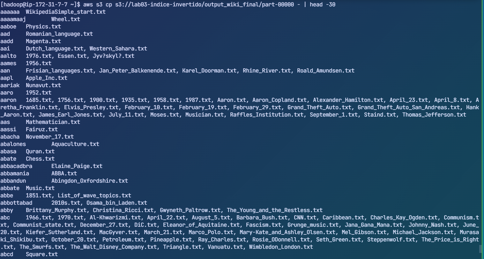
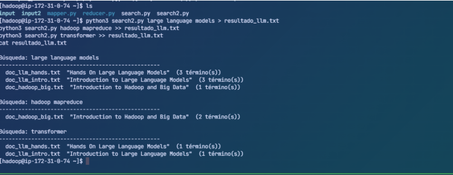
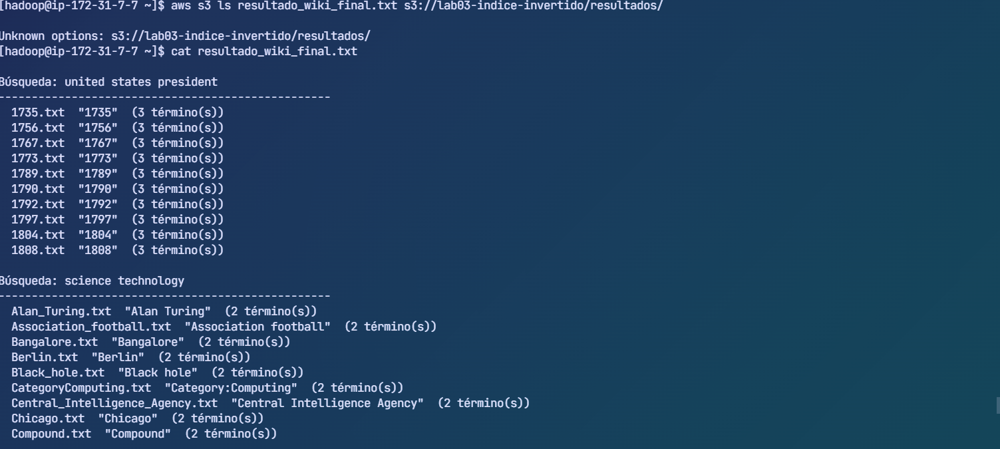

# Índice Invertido con Hadoop MapReduce en Amazon EMR

**Curso:** BigData 2026
**Alumno:** Rivas Huanca, Diego Raúl

---

## ¿Qué es un índice invertido?

Relaciona cada palabra con los documentos donde aparece:

```
hadoop  → doc1.txt, doc3.txt
big     → doc2.txt, doc8.txt
amazon  → doc5.txt
```

---

## Arquitectura del clúster

- Amazon EMR 7.9.0 — Hadoop 3.4.1
- 1 nodo master m5.xlarge (4 vCPU, 16 GB)
- 3 nodos worker Core m5.xlarge (4 vCPU, 16 GB c/u)
- Almacenamiento: Amazon S3

---

## Configuración SSH (Windows + Wave)

Descargar clave desde Vocareum: AWS Details → Download PEM → labsuser.pem

Creamos si no existe usando PowerShell:
````powerShell
touch C:\Users\DIEGO\.ssh\config
````


Editamos
````powerShell
notepad C:\Users\DIEGO\.ssh\config
````

Edita C:\Users\TU_USUARIO\ .ssh\config:
```
Host aws-emr-lab
    HostName <DNS-del-master>
    User hadoop
    IdentityFile C:/Users/TU_USUARIO/Documents/labsuser.pem
```

Conectarse:
```bash
ssh aws-emr-lab
```

Wave connections.json:
```json
"aws-emr-lab": { "conn:wshenabled": true }
```

Wave widgets.json:
```json
"widget@ssh-aws-emr-lab": {
    "display:order": 7, "icon": "server", "label": "EMR Master",
    "color": "#FF9900",
    "blockdef": { "meta": { "view": "term", "controller": "shell", "connection": "aws-emr-lab" } }
}
```

Nota: cada vez que el cluster se reinicia cambia el DNS. Actualiza HostName en el config.

---

## Estructura S3

```
s3://lab03-indice-invertido/
├── scripts/         mapper.py, reducer.py, parse_wiki.py,
│                    build_title_index.py, titles.txt,
│                    search.py, search2.py, search_gutenberg.py, search_wiki.py
├── input/           3 libros Project Gutenberg
├── input2/          3 docs tematicos (prueba inicial)
├── input_wiki/      4999 articulos Wikipedia individuales
├── output/          indice Gutenberg
├── output2/         indice docs tematicos
├── output_wiki_final/ indice Wikipedia (definitivo)
└── resultados/      resultado_gutenberg.txt, resultado_llm.txt, resultado_wiki_final.txt
```

---

## Flujo MapReduce

```
Input (S3) → Mapper → Shuffle & Sort → Reducer → Output (S3)
```

- Mapper: extrae palabras y emite palabra → nombre_archivo
- Shuffle & Sort: Hadoop agrupa todos los pares por palabra automaticamente
- Reducer: emite palabra → doc1, doc2, ...

---

## Comandos esenciales

Recuperar scripts al iniciar nueva sesion:
```bash
aws s3 cp s3://lab03-indice-invertido/scripts/ ~/ --recursive
```

Guardar antes de cerrar sesion:
```bash
aws s3 cp ~/ s3://lab03-indice-invertido/scripts/ --exclude "*" --include "*.py" --include "titles.txt"
```

---

## Nota importante sobre los jobs

Los jobs MapReduce se ejecutan una sola vez por dataset. Los índices generados
quedan guardados permanentemente en S3 y no es necesario relanzarlos a menos que:
- Se borre accidentalmente el output de S3
- Se cambien los documentos de entrada
- Se modifiquen mapper.py o reducer.py

Los outputs ya generados son:
- `output/`            → índice Gutenberg
- `output2/`           → índice docs temáticos  
- `output_wiki_final/` → índice Wikipedia (tardó ~2h 15min)

## Prueba 1 — Documentos tematicos (replica ejemplo del lab)

Crear documentos:
```bash
mkdir input2
cat > input2/doc_llm_intro.txt << 'EOF'
Introduction to Large Language Models
Large language models are deep learning systems trained on massive text datasets.
They use transformer architecture with attention mechanisms.
Models like GPT and Claude are examples of large language models.
EOF

cat > input2/doc_llm_hands.txt << 'EOF'
Hands On Large Language Models
This guide covers practical applications of large language models.
Learn to prompt engineer and fine tune language models.
Hands on experience with transformer models and neural networks.
EOF

cat > input2/doc_hadoop_big.txt << 'EOF'
Introduction to Hadoop and Big Data
Hadoop is a framework for distributed processing of large datasets.
MapReduce is the core programming model in Hadoop ecosystem.
Big data processing requires distributed computing and storage systems.
EOF
```

Subir y lanzar job:
```bash
aws s3 cp input2/ s3://lab03-indice-invertido/input2/ --recursive

hadoop jar /usr/lib/hadoop-mapreduce/hadoop-streaming.jar \
  -input s3://lab03-indice-invertido/input2/ \
  -output s3://lab03-indice-invertido/output2/ \
  -mapper mapper.py -reducer reducer.py -file mapper.py -file reducer.py
```

Revisando el indice invertido:
```bash
aws s3 cp s3://lab03-indice-invertido/output2/part-00000 - | head -50
```
Resultados:
```
attention       doc_llm_intro.txt
claude  doc_llm_intro.txt
deep    doc_llm_intro.txt
learning        doc_llm_intro.txt
mapreduce       doc_hadoop_big.txt
model   doc_hadoop_big.txt
neural  doc_llm_hands.txt
storage doc_hadoop_big.txt
tune    doc_llm_hands.txt
with    doc_llm_hands.txt, doc_llm_intro.txt
```
Buscar:
```bash
python3 search2.py large language models
python3 search2.py hadoop mapreduce
python3 search2.py transformer
```

Resultados:
```
Busqueda: large language models
--------------------------------------------------
  doc_llm_intro.txt  "Introduction to Large Language Models"  (3 termino(s))
  doc_llm_hands.txt  "Hands On Large Language Models"         (2 termino(s))
  doc_hadoop_big.txt "Introduction to Hadoop and Big Data"    (1 termino(s))
```

---

## Prueba 2 — Project Gutenberg (3 libros clasicos)

```bash
mkdir input
wget -O input/doc1.txt https://www.gutenberg.org/cache/epub/1342/pg1342.txt
wget -O input/doc2.txt https://www.gutenberg.org/cache/epub/11/pg11.txt
wget -O input/doc3.txt https://www.gutenberg.org/cache/epub/1661/pg1661.txt

aws s3 cp input/ s3://lab03-indice-invertido/input/ --recursive

hadoop jar /usr/lib/hadoop-mapreduce/hadoop-streaming.jar \
  -input s3://lab03-indice-invertido/input/ \
  -output s3://lab03-indice-invertido/output/ \
  -mapper mapper.py -reducer reducer.py -file mapper.py -file reducer.py
```

Revisando el indice invertido:
```bash
aws s3 cp s3://lab03-indice-invertido/output/part-00000 - | head -50
```
Resultados:
```
aberdeen        doc3.txt
abhorrence      doc1.txt
able            doc1.txt, doc2.txt, doc3.txt
abolution       doc1.txt
abomination     doc3.txt
about           doc1.txt, doc2.txt, doc3.txt
abroad          doc1.txt, doc3.txt
absence         doc1.txt, doc2.txt
absent          doc1.txt, doc3.txt
absolutely      doc1.txt, doc3.txt
abstracted      doc3.txt
abusive         doc1.txt, doc3.txt
accede          doc1.txt
accent          doc1.txt, doc3.txt
acceptance      doc1.txt, doc2.txt, doc3.txt
accepted        doc1.txt, doc2.txt, doc3.txt
accepting       doc1.txt, doc2.txt, doc3.txt
accessory       doc3.txt
accidental      doc1.txt, doc3.txt
accidents       doc3.txt
accompany       doc1.txt, doc3.txt
accompli        doc3.txt
accomplishments doc1.txt, doc3.txt
```

Buscar:
```bash
python3 search_gutenberg.py holmes watson
python3 search_gutenberg.py alice rabbit wonderland
```

Resultados:
```
Busqueda: holmes watson
--------------------------------------------------
  doc3.txt  "The Adventures of Sherlock Holmes - Arthur Conan Doyle"  (2 termino(s))
  doc1.txt  "Pride and Prejudice - Jane Austen"                       (1 termino(s))

Busqueda: alice rabbit wonderland
--------------------------------------------------
  doc2.txt  "Alice in Wonderland - Lewis Carroll"                     (3 termino(s))
  doc3.txt  "The Adventures of Sherlock Holmes - Arthur Conan Doyle"  (2 termino(s))
```

---

## Prueba 3 — Simple Wikipedia 4999 articulos (prueba principal)

Preparar dataset:
```bash
cd /mnt
wget https://dumps.wikimedia.org/simplewiki/latest/simplewiki-latest-pages-articles.xml.bz2
bzip2 -d simplewiki-latest-pages-articles.xml.bz2
# Resultado: 1.6 GB, 30 millones de lineas

cd ~
python3 parse_wiki.py          # genera 4999 archivos en /mnt/wiki_docs/
python3 build_title_index.py   # genera titles.txt

aws s3 cp /mnt/wiki_docs/ s3://lab03-indice-invertido/input_wiki/ --recursive
```

Lanzar job:
```bash
hadoop jar /usr/lib/hadoop-mapreduce/hadoop-streaming.jar \
  -input s3://lab03-indice-invertido/input_wiki/ \
  -output s3://lab03-indice-invertido/output_wiki_final/ \
  -mapper mapper.py -reducer reducer.py -file mapper.py -file reducer.py
```

Tiempo de ejecucion: ~2 horas 15 minutos con 3 workers.
El job corre en YARN si se cierra SSH el job sigue corriendo.

Verificar:
```bash
aws s3 ls s3://lab03-indice-invertido/output_wiki_final/
aws s3 cp s3://lab03-indice-invertido/output_wiki_final/part-00000 - | head -30
```

Revisando el indice invertido:
```
aws s3 cp s3://lab03-indice-invertido/output_wiki_final/part-00000 - | head -30
```

Resultados:
```
aaaaaa  WikipediaSimple_start.txt
aaaamaaj        Wheel.txt
aaboe   Physics.txt
aad     Romanian_language.txt
aadd    Magenta.txt
aai     Dutch_language.txt, Western_Sahara.txt
aalto   1976.txt, Essen.txt, Jyv?skyl?.txt
aames   1956.txt
aan     Frisian_languages.txt, Jan_Peter_Balkenende.txt, Karel_Doorman.txt, Rhine_River.txt, Roald_Amundsen.txt
aapl    Apple_Inc.txt
aariak  Nunavut.txt
aaro    1952.txt
aaron   1685.txt, 1756.txt, 1900.txt, 1935.txt, 1958.txt, 1987.txt, Aaron.txt, Aaron_Copland.txt, Alexander_Hamilton.txt, April_23.txt, April_8.txt, Aretha_Franklin.txt, Elvis_Presley.txt, February_10.txt, February_19.txt, February_29.txt, Grand_Theft_Auto.txt, Grand_Theft_Auto_San_Andreas.txt, Hank_Aaron.txt, James_Earl_Jones.txt, July_11.txt, Moses.txt, Musician.txt, Raffles_Institution.txt, September_1.txt, Staind.txt, Thomas_Jefferson.txt
aas     Mathematician.txt
aassi   Fairuz.txt
abacha  November_17.txt
abalones        Aquaculture.txt
abasa   Quran.txt
abate   Chess.txt
abbacadbra      Elaine_Paige.txt
abbamania       ABBA.txt
abbandun        Abingdon_Oxfordshire.txt
abbate  Music.txt
abbe    1851.txt, List_of_wave_topics.txt
abbottabad      2010s.txt, Osama_bin_Laden.txt
abby    Brittany_Murphy.txt, Christina_Ricci.txt, Gwyneth_Paltrow.txt, The_Young_and_the_Restless.txt
abc     1966.txt, 1970.txt, Al-Khwarizmi.txt, April_22.txt, August_5.txt, Barbara_Bush.txt, CNN.txt, Caribbean.txt, Charles_Kay_Ogden.txt, Communism.txt, Communist_state.txt, December_27.txt, DiC.txt, Eleanor_of_Aquitaine.txt, Fascism.txt, Grunge_music.txt, Jana_Gana_Mana.txt, Johnny_Nash.txt, June_20.txt, Kiefer_Sutherland.txt, MacGyver.txt, March_21.txt, Marco_Polo.txt, Mary-Kate_and_Ashley_Olsen.txt, Mel_Gibson.txt, Michael_Jackson.txt, Murasaki_Shikibu.txt, October_20.txt, Petroleum.txt, Pineapple.txt, Ray_Charles.txt, Rosie_ODonnell.txt, Seth_Green.txt, Steppenwolf.txt, The_Price_is_Right.txt, The_Smurfs.txt, The_Walt_Disney_Company.txt, Triangle.txt, Vanuatu.txt, Wimbledon_London.txt
abcd    Square.txt
abdacom January_8.txt
abdel   1918.txt, 1950s.txt, 1960s.txt, 1970.txt, 1981.txt, 20th_century.txt, April_18.txt, Egypt.txt, February_25.txt, February_5.txt, January_16.txt, July_26.txt, June_23.txt, November_14.txt, November_17.txt, Robert_Mugabe.txt, September_28.txt, Sudan.txt, Tunisia.txt, Yasser_Arafat.txt
```

Buscar:
```bash
#Recuperamos solo si la sesion es nueva, el titles.txt se genera una sola vez localmente para evitar 4999 llamadas individuales a S3 en cada busqueda.
aws s3 cp s3://lab03-indice-invertido/scripts/titles.txt .
python3 search_wiki.py united states president
python3 search_wiki.py science technology
python3 search_wiki.py world war
```

Guardamos (opcionalmente se pueden subir a S3):
```bash
#Guardamos los resultados finales
python3 search_wiki.py united states president > resultado_wiki_final.txt
python3 search_wiki.py science technology >> resultado_wiki_final.txt
python3 search_wiki.py world war >> resultado_wiki_final.txt
#Lo sube a s3 para que quede persistente
aws s3 cp resultado_wiki_final.txt s3://lab03-indice-invertido/resultados/
#Para recuperar el resultado despues
aws s3 cp s3://lab03-indice-invertido/resultados/resultado_wiki_final.txt .

```

Resultados:
```
Búsqueda: united states president
--------------------------------------------------
  1735.txt  "1735"  (3 término(s))
  1756.txt  "1756"  (3 término(s))
  1767.txt  "1767"  (3 término(s))
  1773.txt  "1773"  (3 término(s))
  1789.txt  "1789"  (3 término(s))
  1790.txt  "1790"  (3 término(s))
  1792.txt  "1792"  (3 término(s))
  1797.txt  "1797"  (3 término(s))
  1804.txt  "1804"  (3 término(s))
  1808.txt  "1808"  (3 término(s))

Búsqueda: science technology
--------------------------------------------------
  Alan_Turing.txt  "Alan Turing"  (2 término(s))
  Association_football.txt  "Association football"  (2 término(s))
  Bangalore.txt  "Bangalore"  (2 término(s))
  Berlin.txt  "Berlin"  (2 término(s))
  Black_hole.txt  "Black hole"  (2 término(s))
  CategoryComputing.txt  "Category:Computing"  (2 término(s))
  Central_Intelligence_Agency.txt  "Central Intelligence Agency"  (2 término(s))
  Chicago.txt  "Chicago"  (2 término(s))
  Compound.txt  "Compound"  (2 término(s))
  Creating.txt  "Creating"  (2 término(s))

Búsqueda: world war
--------------------------------------------------
  1373.txt  "1373"  (2 término(s))
  1835.txt  "1835"  (2 término(s))
  1851.txt  "1851"  (2 término(s))
  1860s.txt  "1860s"  (2 término(s))
  1870.txt  "1870"  (2 término(s))
  1872.txt  "1872"  (2 término(s))
  1891.txt  "1891"  (2 término(s))
  1906.txt  "1906"  (2 término(s))
  1907.txt  "1907"  (2 término(s))
  1910s.txt  "1910s"  (2 término(s))
```

---

## Conclusiones

- El dump de Simple Wikipedia tenia 30 millones de lineas y 1.6 GB procesado de forma distribuida entre 3 workers.
- MapReduce trabaja palabra por palabra, no por peso de archivo cada linea se procesa en paralelo.
- Los 4999 archivos individuales permiten resultados precisos: cada archivo representa un articulo real de Wikipedia.
- El titles.txt se genera una sola vez localmente para evitar 4999 llamadas individuales a S3 en cada busqueda.
- S3 actua como almacenamiento persistente todos los indices sobreviven al apagado del cluster.
- EMR abstrae la complejidad de configurar Hadoop, permitiendo enfocarse en Mapper y Reducer.

---

## Capturas

### Cluster EMR activo


### Mapper y Reducer


### Terminal Wave conectado al master EMR
En el archivo connections.json se configura la conexion SSH al master EMR.

En el archivo widgets.json se configura el widget de terminal para conectarse al master EMR.

En wave se inicia el widget con un click y se abre una terminal conectada al master EMR.

En wave en la sesion SSH del master EMR se pueden ejecutar comandos como si estuvieras conectado por terminal tradicional.

### Job corriendo en YARN


### Indice invertido generado


### Prueba 1 — Docs tematicos


### Prueba 2 — Gutenberg


### Prueba 3 — Wikipedia 4999 articulos

